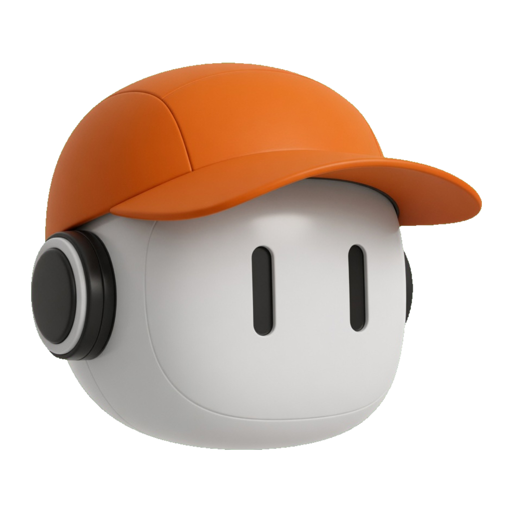

# dreemurr

A local-first spatial canvas for macOS.

Drop cards anywhere. Connect them. Group them into boxes. Your boards live on disk as `.dreem` files in `~/Documents/dreemurr` — not in a cloud account.

<p align="center">
  
</p>

## Install

Grab the latest **macOS `.dmg`** from [Releases](https://github.com/bigmacfive/dreemurr/releases).

Open it, drag **dreemurr** into **Applications**, then launch from Spotlight or the Dock.

> Apple Silicon (aarch64). Unsigned local build — macOS may ask you to allow it under System Settings → Privacy & Security.

## What it is

- Spatial notes: cards, connections, boxes, lists, drawing
- Multiple spaces, search, tags, and tasks
- JSON / `.dreem` import and export
- URL previews and YouTube embeds without a Kinopio account
- Two-finger trackpad pan, native traffic lights, overlay titlebar

Based on [Kinopio](https://kinopio.club). This fork is a Mac-only local app, not the hosted product.

## Develop

```bash
git clone https://github.com/bigmacfive/dreemurr.git
cd dreemurr
npm install
npm run desktop
```

```bash
npm run test
npm run desktop:build   # dreemurr.app + .dmg
```

Spaces are stored at `~/Documents/dreemurr/*.dreem`. Every valid file in that folder appears in the in-app space list.

## License

[PolyForm Noncommercial 1.0.0](./LICENSE.md). Kinopio is © Kinopio LLC. dreemurr is an independent desktop fork.
